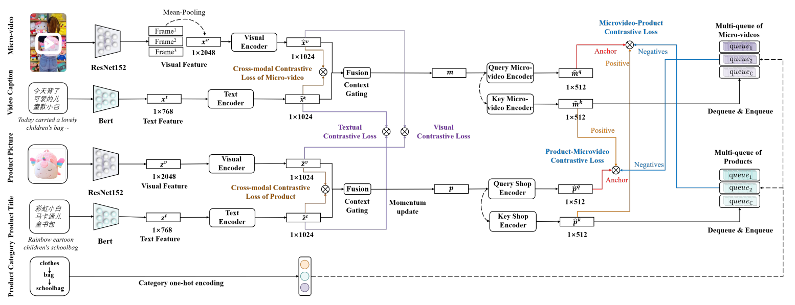

# Multi-queue Momentum Contrast for Microvideo-Product Retrieval

This repo has the PyTorch implementation and datasets of our WSDM 2023 paper: Multi-queue Momentum Contrast for Microvideo-Product Retrieval

## Introduction
In this work, We formulate the microvideo-product retrieval task, which is the first attempt to explore the retrieval between the multi-modal and multi-modal instances.

A novel approach named Multi-Queue Momentum Contrast (MQMC) network is proposed for the bidirectional retrieval, consisting of the uni-modal feature and multi-modal instance representation learning. Moreover, a discriminative selection strategy with multi-queue is used to distinguish the importance of different negatives based on their categories. 
We collect two large-scale microvideo-product datasets (MVS and MVS-large) for evaluation and manually construct the hierarchical category ontology, which covers sundry products in daily life. Extensive experiments show that MQMC outperforms the state-of-the-art baselines.

## Requirements
* Conda
  * install conda: [https://conda.io/projects/conda/en/latest/user-guide/install/index.html](https://conda.io/projects/conda/en/latest/user-guide/install/index.html)
  * create a new conda environment:
      * if you are running with GPU: 
        ```
        conda env create -f environment-gpu.yml
        conda activate mqmc
        ```
        Dependencies include support for CUDA_11.4. If you are using a different CUDA version update the dependencies accordingly.
      * if you are running with CPU:   
        ```
        conda env create -f environment-cpu.yml
        conda activate mqmc
        ```

## Dataset
We collect the microvideo-product pairs from the popular micro-video sharing platforms and achieve two datasets: MVS and MVS-large,  which contain 13,165 and 126,206 microvideo-product pairs respectively.
* `cd dataset`
* Download MVS dataset into dataset folder
  * download `MVS_train_dataset.pkl` from [https://drive.google.com/file/d/1AY7fC4XFy8hahoUgiz4_xxehwbdSygIH/view?usp=sharing](https://drive.google.com/file/d/1AY7fC4XFy8hahoUgiz4_xxehwbdSygIH/view?usp=sharing)
  * download `MVS_val_dataset.pkl` from [https://drive.google.com/file/d/11kgFnAMfLASPWNfVZ7I-QACE0E7buiSk/view?usp=sharing](https://drive.google.com/file/d/11kgFnAMfLASPWNfVZ7I-QACE0E7buiSk/view?usp=sharing)
  * download `MVS_test_dataset.pkl` from [https://drive.google.com/file/d/1skBv7NoYmyidVryYbRHlvtKhcTuLyIGt/view?usp=sharing](https://drive.google.com/file/d/1skBv7NoYmyidVryYbRHlvtKhcTuLyIGt/view?usp=sharing)
* Download MVS-large dataset into dataset folder
  * download `MVS_large_train_dataset.pkl` from [https://drive.google.com/file/d/1KwnuPmPtXoTHPrmxC5IPziYkW_nbz2wq/view?usp=sharing](https://drive.google.com/file/d/1KwnuPmPtXoTHPrmxC5IPziYkW_nbz2wq/view?usp=sharing)
  * download `MVS_large_val_dataset.pkl` from [https://drive.google.com/file/d/1EOKhWAoI7DlPRuAbo0Frbv9zpWnKywdC/view?usp=sharing](https://drive.google.com/file/d/1EOKhWAoI7DlPRuAbo0Frbv9zpWnKywdC/view?usp=sharing)
  * download `MVS_large_test_dataset.pkl` from [https://drive.google.com/file/d/1_QCpEIiLV3dwfthJqp0mCUEuYD6FRpkO/view?usp=sharing](https://drive.google.com/file/d/1_QCpEIiLV3dwfthJqp0mCUEuYD6FRpkO/view?usp=sharing)


In addition, we manually construct the [hierarchical category ontology](flare-2.json) including 6 upper ontologies, 30 middle ontologies and 316 lower ontologies.


## Example to Run the Codes 
The instruction of commands has been clearly stated in the codes.

* MVS dataset
```
python main.py --workers=32 --epochs=50 --start_epoch=0 --batch_size=256 --batch_val=128 --lr=0.0001 --momentum=0.99 --wd=1e-6 -print_freq=10 --gpu=0 --moco_dim=512 --moco_k=2048 --moco_m=0.999 --moco_t=0.07 --videodim=2048 --imgdim=2048 --textdim=768 --alpha=0.8 --beta=0.1 --gama=0.1 --mvs=1 --mvslarge=0
```
* MVS-large dataset
```
python main.py --workers=32 --epochs=50 --start_epoch=0 --batch_size=256 --batch_val=128 --lr=0.0001 --momentum=0.99 --wd=1e-6 -print_freq=10 --gpu=0 --moco_dim=512 --moco_k=2048 --moco_m=0.999 --moco_t=0.07 --videodim=2048 --imgdim=2048 --textdim=768  --alpha=0.8 --beta=0.1 --gama=0.1 --mvs=0 --mvslarge=1
```


## Citation
If you want to use our codes and datasets in your research, please cite:

``` 
@inproceedings{MQMC,
  title     = {Multi-queue Momentum Contrast for Microvideo-Product Retrieval},
  author    = {Du, Yali and 
               Wei, Yinwei and 
               Ji, Wei and
               Liu, Fan and 
               Luo, Xin and 
               Nie, Liqiang},
  booktitle={Proceedings of the Sixteenth ACM International Conference on Web Search and Data Mining (WSDM '23), February 27-March 3, 2023, Singapore, Singapore},
  pages={--},
  year={2023}
}
``` 

## Contact
If You find any problems or have any questions, please contact with Duyali2000 at gmail.com.


